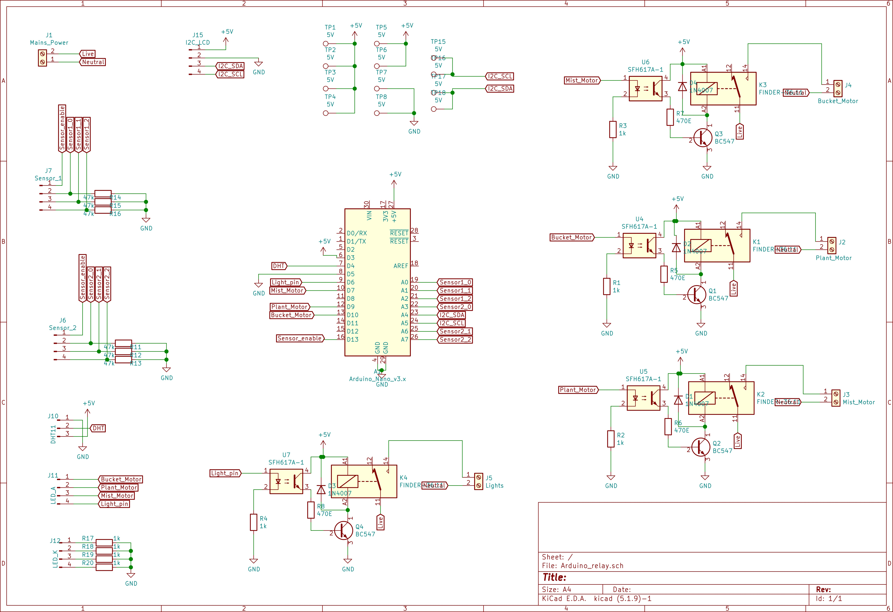
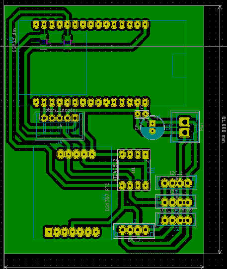

Automatic_Hydroponics_V2
==========================

# The schematic diagram
## The schematic diagram of Master board

* The master board has an ESP32, DS1307 RTC clock, AT24C512 EEPROM and an I2C LCD display.
* The master board has a JST connecter port to connect to slave board. 

## The schematic of Slave Board

* The slave board has an Arduino Nano, DHT11 sensor, 4 relays. 
* The master board and slave board are connected with I2C bus.

# PCB layout
## The PCB layout of Master board


## The PCB layout of Master board


# Building the hardware
## Master board


## Slave Board


## Using `I2CSB` library.

This arduino compatible library is made to simplify the communication definition that happens between master *esp32* and slave *arduino nano*.

> I2CSB stands for I2C Slave board

The slave arduino nano does the following:
- controls 4 relays named as

1. Bucket Motor connected to pin 10
2. Plant Motor  connected to pin 9
3. Mist Motor   connected to pin 7
4. Light Pin    connected to pin 6

- Is connected to a DHT11 Temperature and Humidity sensor on pin 4.
- Has two sets of water level sensors with each water level sensor can detect 3 distinct points in the used bucket.

 You can fetch the slave code here [Arduino_slave.ino](Arduino_sketches/Library/Arduino_I2C_slave/Arduino_I2C_slave.ino)
 
The Master ESP32 can access these function using the `I2CSB` Library. As the name suggests the communication happens in I2C protocol. 

## How to add the library?

To use the library just navigate to [I2CSB](Arduino_sketches/Library/I2CSB/) and download it as zip file. Later in arduino IDE add this library using library manager and get started with the library using examples.

## How to use the functions in the library?

1. First instantiate the class I2CSB with a slave address
```
#define Slave_address 0x2F
I2CSB DB1(Slave_address);
```
2. Initialize the I2C communication by calling `Wire.begin()`

3. The library has following functions

| Function name       | What is returned | return type | Arguments |
|---------------------|------------------|-------------|-----------|
| 1. isConnected()    |true if slave is connected | bool| no arguments|
| 2. getLevel()       |Level encoded in single byte| byte| no arguments|
| 3. getTemperature() |Temperature       | int  | no arguments|
| 4. getHumidity()    |Humidity          | int  | no arguments|
| 5. setOutputs()     |`True` if the outputs are set correctly `False` if fails to set| bool | 4 bool variables|

## Handelling the Errors and Miscommunication

The library also can monitor communication error or Miscommunication took place. This is how:

1. For `isConnected()` function the master sends a request to get water level. If there is no error in the received information then the function returns `True`. In the event of death of slave or the slave is not connected or there is a communication error the function returns `False`.
2. For `getLevel()` function the return type is byte and the encoded level information in the byte is as follows `x LA2 LA1 LA0 0 LB2 LB2 LB0` Here LA2,1,0 are points in sensor A and LB2,1,0 are points in Level B sensor. The `x` bit carries the error information. If there is no error in the communication then `x = 1 ` else `x = 0`.
3. For `getTemperature()` function thenreturn type is integer. And the DHT11 sensor can measure the temperatures between 0 to 60degC with a resolution of 1degC. So the information we get out of the sensor can never hit negative temperature. So the function returns -10 if there is any error and returns value between 0 and 60 if there is no error.
4. Similarly for `getHumidity()` function, the return type is int and has values between 20 to 80. so if there is any error then the returned value will be -10.
5. For setOutputs() the return value is `True` if there is no error in communication as well as the outputs are set as expected. 
 The arguments in `setOutputs()` function is in this order `setOutputs(BucketMotor, PlantMotor, MistMotor, LightPin)`
 
 ## The commuication definition.
 
 * The communication is built on I2C protocol.
 * The master sends a byte contains the function the slave has to performs along with the arguments encoded in the single byte.
 * The master requests the slave 200 milliseconds later to send the fetched data/ performed action feedback encoded in 3 bytes as follows.

| Function name       | Sent Byte | Received  bytes |
|---------------------|-----------|-----------------|
| 2. getLevel()       | 0xAA      | 0xAA 0xYY 0xYY  |
| 3. getTemperature() | 0xCA      | 0xCA 0xYY 0xYY  |
| 4. getHumidity()    | 0x5c      | 0x5C 0xYY 0xYY  |
| 5. setOutputs()     | 0x60      | 0x60 0xYY 0xYY  |
| 1. isConnected()    | 0xAA      | 0xAA 0xYY 0xYY  |

* The first byte is the data that is sent by master to slave so that the master can verify that slave performed correct action. and there was no miscommunication happened. 
* The second two bytes are identical. If they match then the master decides that the information received is correct and and proceeds to decode the bytes.
* The `isConnected()` function is same as `getLevel()` function with a different data type. Because I was ~lazy~ to write a new function for that purpose. 

